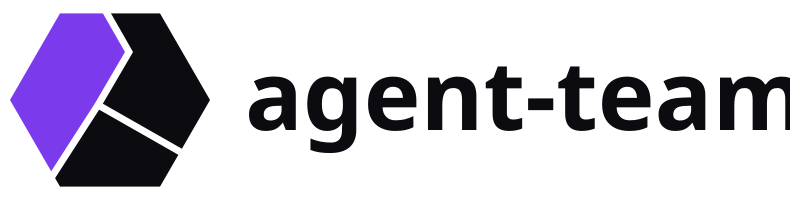
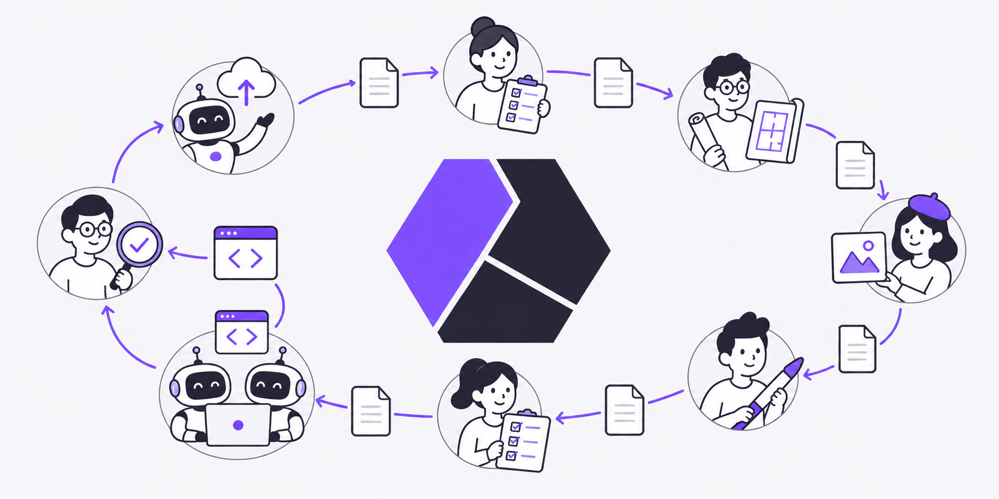
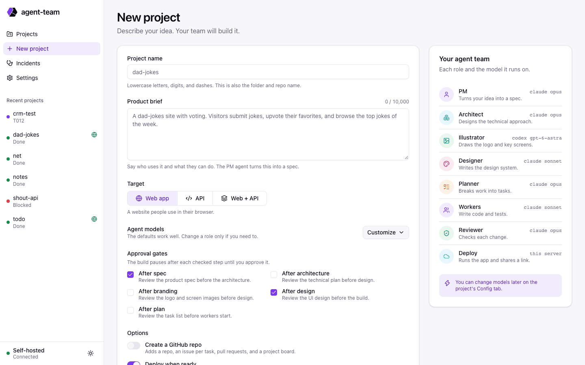
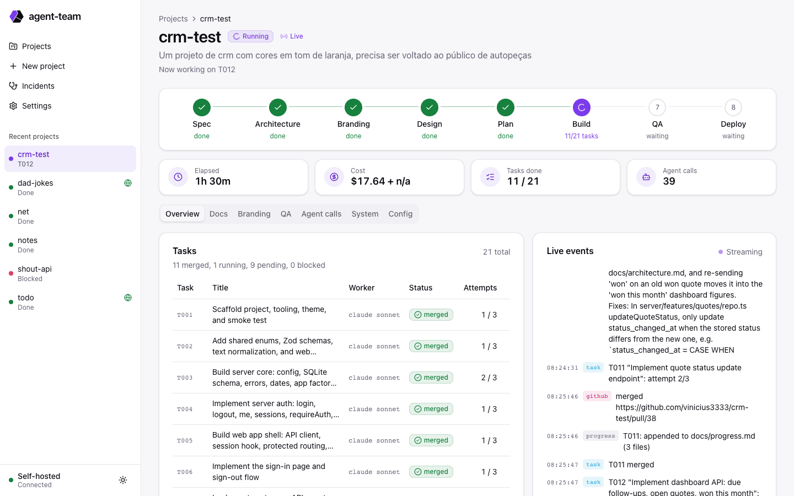
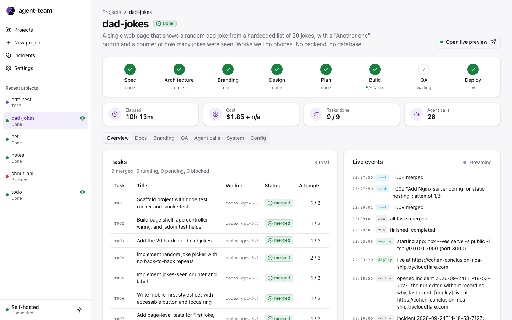
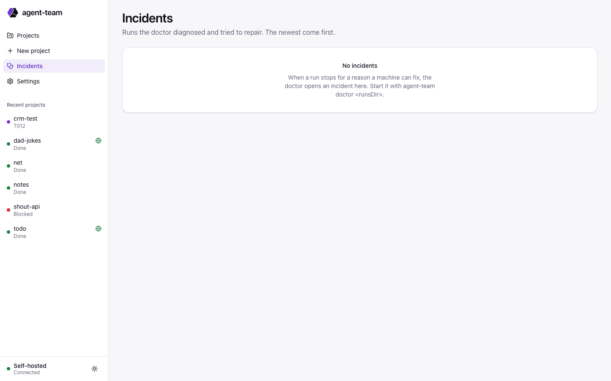

<picture>
  <source media="(prefers-color-scheme: dark)" srcset="docs/brand/logo/horizontal-dark.svg">
  
</picture>

A self-hosted orchestrator that turns a plain-text product brief into a working web app or API. A team of AI agents writes the spec, architecture, branding, design system, and task plan. Scoped worker agents then build the app one task at a time, and a reviewer checks each task.



All roles default to Claude. The illustrator uses Codex, because it generates the logo and screen images. Any role can use any supported runner.

## Requirements

- Node.js 22.18 or later (runs TypeScript directly, uses built-in `node:sqlite`)
- git
- The `claude` CLI (Claude Code), logged in
- The `codex` CLI, logged in (used for image generation)
- Docker (agent sandbox, QA screenshots, and the live preview)
- The `gh` CLI, logged in with the `project` scope, if you want GitHub publishing

## Install

```sh
npm install
npm run build:ui
```

`npm run build:ui` builds the dashboard in `web/` into `web/dist/`. Run it again after you pull changes to `web/`.

## Quick start

Most work happens in the dashboard. You type the brief in a form, and the agents take it from there.

1. Start the dashboard with the folder that will hold your projects:

   ```sh
   CLAUDE_CODE_OAUTH_TOKEN=... node src/cli.ts ui ~/projects --port 4400
   ```

   The server starts agent runs itself, so it needs `CLAUDE_CODE_OAUTH_TOKEN` (from `claude setup-token`) in its environment.
2. Open `http://127.0.0.1:4400` (see [Access](#access) to reach it from another machine).
3. Click **New project** and fill in the form:

   | Field | What it does |
   | --- | --- |
   | Project name | Folder and repository name. Lowercase letters, digits, and dashes. |
   | Product brief | Your idea in plain words: who uses it and what they can do. The PM agent turns it into a spec. |
   | Target | Web app, API, or both. |
   | Worker provider | Claude (default) or Codex for the workers that write the code. |
   | Approval gates | Phases where the run stops for your review: spec, architecture, branding, design, plan. |
   | Create GitHub repo | Repository, one issue per task, a pull request per phase and task, and a project board. |
   | Deploy when ready | Runs the finished app and gives you a public preview URL. |
   | Branding | Generates the logo and the main screens before the design phase. |

4. Click **Start build**. The project page shows the pipeline, tasks, live events, agent calls, cost, and elapsed time (only while a run is active).







## Working with a run

| Situation | What you see | What to do |
| --- | --- | --- |
| A phase waits at a gate | An approval panel with the phase output (docs, branding images, task list) | **Approve** to continue, or write notes and click **Request changes**. The agent redoes the phase with your notes. |
| A task needs a decision | A banner with the reason, for example a scope change that touches shared files | Edit `tasks.json` if needed, then **Retry**. |
| The run stopped or paused | A banner with the reason and the key error lines | Fix the cause, then **Resume run**. |
| The run hit its budget | A budget banner | **Raise budget and resume** adds 50% to `budget.runUsd`. |
| QA failed | The QA tab: findings, test output, and each screenshot next to its branding image | Nothing. Fix tasks run on their own, up to `qa.maxRounds`. |
| You have a question about the run | The **Lead** tab: a chat with the project lead agent. It reads the project state, docs, and transcripts, and suggests actions such as retry or resume. | Ask in plain words. Click a suggested action to apply it. The lead never changes the project on its own, and chat cost does not count against the run budget. |
| The app is live | A **Live** badge and the preview URL | Open it. |

## Access

The dashboard listens on `127.0.0.1` only and has no login. Reach it from another machine in one of two ways:

- SSH tunnel: `ssh -L 4400:127.0.0.1:4400 you@server`, then open `http://localhost:4400`.
- Tailscale: `tailscale serve --bg --https=4400 http://127.0.0.1:4400`, then open `https://<machine>.<tailnet>.ts.net:4400`. Only devices on your tailnet can reach it.

Do not expose the port to the internet. Anyone who reaches it can start paid agent runs. The server answers only `localhost`, `127.0.0.1`, and `*.ts.net` hosts; add others with `AGENT_TEAM_UI_HOSTS`.

## Command line

Everything the dashboard does also works from the command line, which is useful for scripts:

```sh
node src/cli.ts init ~/projects/my-app --brief brief.md   # create a project from a brief file
node src/cli.ts run ~/projects/my-app                     # start or resume the run
node src/cli.ts approve ~/projects/my-app spec            # approve a gate, then run again
node src/cli.ts status ~/projects/my-app                  # phases, tasks, and cost
node src/cli.ts retry ~/projects/my-app T007              # retry a blocked task
node src/cli.ts deploy ~/projects/my-app                  # redeploy the live preview
node src/cli.ts undeploy ~/projects/my-app                # stop the live preview
node src/cli.ts doctor ~/projects                         # watch every project and repair stopped runs
```

`init` creates the folder, runs `git init`, writes `input.md`, and copies `pipeline.example.yaml` to `pipeline.yaml`. Edit `pipeline.yaml` to choose models, gates, and budget.

## Pipeline

| Phase | Role | Output |
| --- | --- | --- |
| spec | PM | `docs/spec.md` |
| architecture | Architect | `docs/architecture.md`, `docs/adr/*`, `contracts/openapi.yaml` |
| branding | Illustrator, then Design reviewer | `design/branding/01-logo.png`, desktop screens `02-<screen>.png` and later, mobile screens `02-<screen>.mobile.png`, `design/branding/README.md` |
| design | Designer, then Design reviewer | step 1: `design/tokens.css`, `design/logo.svg`, `design/logo-mark.svg`, `docs/design-system.md`; the orchestrator renders `design/favicon/`; step 2: `docs/design.md` |
| marketing | Marketer, then Design reviewer | `marketing/copy.json`, `marketing/art/*`; the orchestrator renders `marketing/<piece>-<format>.png` and `marketing/manifest.json` |
| plan | Planner | `tasks.json` |
| build | Worker, then Reviewer; Design reviewer for UI tasks | code and tests, one or more atomic commits per task |
| qa | QA | `.agent-team/qa/round-<n>/`: test output, screenshots, `report.json`, verdict; fix tasks `Q<round><n>` in `tasks.json` |
| deploy | none | live preview URL |

`branding.count` (default 4, 2 to 6) sets the number of branding images, logo included. `branding.mobile` (default `true`) adds a phone version of every desktop screen. Set `branding.enabled: false` to skip the phase. Older `pipeline.yaml` files with a `mockups:` key, and `mockups` in `autonomy.gates`, still work.

### Marketing

After the design phase, the `marketer` role (default `codex`) writes launch images for the product. For each piece it writes a headline, a subtitle, and a call to action in the language of `input.md`. Then it picks the image that best shows the problem the product solves:

- **Stock photo:** searched on [Openverse](https://openverse.org) (no API key) and saved with its credit and license.
- **Generated:** drawn with Codex image generation when no good photo exists.

The images carry no text. The orchestrator renders the text, the logo, and the brand tokens over each image with Playwright, offline, in every format in `marketing.formats`: `og` (1200×630), `square` (1080×1080), `story` (1080×1920), and `x` (1600×900). The headline shrinks until it fits. The design reviewer checks the result, and the dashboard's **Marketing** tab shows every piece with download buttons. Add `marketing` to `autonomy.gates` to approve the pieces before the plan. Projects planned before this phase existed skip it.

### Design review and commits

- **Design reviewer** (`design-reviewer` role, default `claude opus`, read-only) approves the branding and design output. On a rejection the phase agent fixes its files in place and the reviewer checks again, once. A second rejection fails the attempt.
- **Favicon.** After design step 1, the orchestrator renders `design/logo-mark.svg` in the Playwright container into `favicon.ico` (16, 32, 48), `favicon.svg`, `apple-touch-icon.png`, `icon-192.png`, `icon-512.png`, a maskable icon, and `site.webmanifest`. The mark must use literal colors and a square `viewBox`. The render needs Docker; without it the phase pauses.
- **Commits.** Branding and design land as one commit per step: logo, desktop screens, mobile screens; tokens, logo, favicon, design system, screens. A worker may end its message with a `{"commits":[{"message","files"}]}` block to split a task into atomic commits. An invalid plan falls back to one commit.
- **UI tasks.** The smoke check loads each route on desktop and on a phone (iPhone 13 viewport). A page that scrolls sideways or has tap targets under 24px fails the attempt. After the code review passes, the design reviewer compares the screenshots with `docs/design.md` and the branding.

### Landing page and demo login

- **Landing page.** For web targets, `US-01` is a public landing page at `/`. The illustrator draws it as `02-landing.png`, the designer specifies it, and the planner adds a task for it.
- **Demo account.** The orchestrator creates one demo account per project (`demo@example.com` and a random password) and keeps it in `state.db`, never in git. Every run of the app gets it as `DEMO_EMAIL` and `DEMO_PASSWORD`: in smoke checks, in QA, and in deploy. The app seeds that user at startup.
- **Signed-in screens.** Screens with `Access: signed in` in `docs/design.md` are captured after the browser logs in at the `Login: /path` page. If the login fails, the check fails.
- **Access.** The dashboard's live deployment card shows the email and password, with copy buttons.

Role prompts live in `prompts/`. Edit them to tune behavior.

State lives in `<projectDir>/.agent-team/`: `state.db` (SQLite) and agent transcripts.

## QA

After every task is merged and before deploy, QA checks the build. Configure it in `pipeline.yaml`:

```yaml
qa:
  enabled: true
  maxRounds: 3   # failed rounds before the run stops for a human
```

Each round:

1. **Tests.** Runs the `install` and `test` commands from `## Commands` in `docs/architecture.md` on a fresh worktree of `main`, in the same sandbox as workers.
2. **Screenshots.** Starts `main` the way deploy does, in container `agent-team-qa-<project>` with no tunnel. A Playwright container (`agent-team-qa-shot-<project>`, built from `mcr.microsoft.com/playwright`) loads every `Route:` line in `docs/design.md` plus `/design-system` at 1440x900 and on a phone, full page, and records the HTTP status and console errors. The browser joins only a per-project internal network, so it reaches the app and not the internet. Both containers and the network are removed after the round. Skipped for `api` targets.
3. **Review.** The `qa` role (default `claude opus`, read-only) compares the screenshots with the branding images and `docs/design-system.md`, and answers `pass` or `fail` with findings and fix tasks.

On pass, deploy runs. On fail, the fix tasks are added to `tasks.json`, built by the worker and reviewer, and QA runs again. After `maxRounds` failed rounds, the run stops with the last fix tasks queued; "Resume run" builds them and starts a new round. A failed test run, an app that does not start, a route that does not load, or a mobile page that scrolls sideways or has tap targets under 24px always fails the round.

The dashboard's QA tab shows each round: verdict, findings, test output, and every screenshot next to its branding image.

## Live preview

With `deploy.enabled: true`, the orchestrator runs the finished app from `main` in a container and exposes it through a Cloudflare quick tunnel. You get a random public URL such as `https://welding-apps-symphony-registrar.trycloudflare.com`, with no account, domain, or open port.

- How to start the app: `deploy.json` from the architect (`install`, `start`, `port`), else `npm start`, else a static `index.html`.
- The URL goes to the logs, `status`, the dashboard, the GitHub epic, and the repository homepage.
- `agent-team deploy <projectDir>` redeploys; `agent-team undeploy <projectDir>` stops it.
- Quick tunnels have no uptime guarantee, and the URL changes if the tunnel container restarts. For a stable address, use a named Cloudflare tunnel with your own domain.
- Anyone with the URL can reach the app. Do not deploy apps that hold real data.

## GitHub

Set `publish.github.enabled: true` to run the whole process in the open on GitHub:

| Step | What happens |
| --- | --- |
| First merge | Creates the repository (private by default) and the labels. |
| Plan written | Opens an epic issue with the brief, one issue per task (acceptance criteria, scope, verify command, dependencies), and a GitHub Projects board with every issue. |
| Each phase and task | Lands through a pull request (`Closes #N`, reviewer verdict, attempt count), merged on GitHub. Local `main` follows. |
| Failed attempt | Posts the failure reason as a comment on the task issue. |
| Blocked task | Adds the `blocked` label and a comment. |
| Board | Todo, In Progress, and Done follow each task. The epic closes when the build completes. |

It all runs on the host, so GitHub credentials never enter a container. If a GitHub step fails, the orchestrator logs it and merges locally.

One-time host setup: `gh auth login`, `gh auth refresh -h github.com -s project`, and `gh auth setup-git`.

## Harness

The harness runs every agent call. It isolates each attempt, retries infrastructure failures, and falls back to other models.

| Concern | Behavior |
| --- | --- |
| Workspace | Each task attempt gets a fresh git worktree on branch `agent/<task>-<attempt>`, created from `main`. A failed attempt is thrown away and never touches `main`. A passing attempt is rebased on `main` and merged fast-forward. |
| Sandbox | With `harness.isolation: docker`, each agent call and verify command runs in its own container: read-only root, only the worktree writable, all capabilities dropped, CPU, memory, and process limits. The CLIs get copies of their auth files, never the real directories. |
| Network | Agent containers join an internal Docker network with no route out. Their only exit is the `agent-team-proxy` container (tinyproxy), which allows HTTPS to an allowlist: Claude, OpenAI, npm, PyPI, GitHub, nodejs.org, plus `harness.network.extraDomains`. |
| Credentials | Containers get copies of `~/.claude/.credentials.json` and `~/.codex/auth.json`. Tokens refreshed inside a container are written back to the host. If `CLAUDE_CODE_OAUTH_TOKEN` is set (from `claude setup-token`), it is passed by name instead. |
| Setup | Each fresh worktree installs dependencies first (`npm ci`, `pnpm`, or `yarn`, detected from the lockfile). |
| Failure classes | `rate_limit`, `auth`, `unavailable`, `missing_binary`, `timeout`, `aborted`, `agent_failure`. Only runner output (stderr, error events) is classified, never the agent's own work. |
| Retry | `unavailable` retries the same model with exponential backoff (`transientRetries`, `backoffMs`). |
| Fallback | `rate_limit`, `auth`, `missing_binary`, and `timeout` move to the next entry in the role's `fallbacks`. |
| Cooldown | A rate-limited runner rests for `cooldownMs` (4x after an auth error) and is skipped meanwhile. When every runner rests, the harness waits up to 1 hour, then pauses the run. |
| Attempts | Infrastructure failures pause the run without using up a task's attempts. Only agent failures count toward `maxRetries`. |
| Scope | Claude workers can edit only their task's `allowedPaths`; other edits are denied at once. A check after the run catches the rest. |
| Blocked tasks | A worker that cannot finish in scope reports why. The planner may widen the scope, add a prerequisite task, or split the task, once. Changes to shared or foreign files wait for you. |
| Retries | A retry gets the rejected diff and the reason. A failing check runs twice before it counts, to catch flaky tests. |
| Shared context | The architect writes `AGENTS.md` (loaded by both CLIs). The harness appends each merged task to `docs/progress.md`. Workers also get a map of the files. |
| Budget | `budget.perTaskUsd` per task and `budget.runUsd` (default 30) per project. |
| Stop | Ctrl+C stops the agents, kills their containers, and removes worktrees. Run again to resume. Exit code 75 means paused. |

Commands: `agent-team reset-cooldowns <projectDir>` clears runner cooldowns after you fix a login.

## Doctor

`agent-team doctor <runsDir>` watches every project in `runsDir`. Every 60 seconds it checks each run. When a run stops for a reason a machine can fix, it opens an incident, asks a doctor agent to diagnose and fix it, and resumes the run. `--once` checks one time and exits, for cron and tests.



### What counts as an incident

| Run state | What the doctor does |
| --- | --- |
| Stopped as `failed` or `paused` | Opens an incident. |
| Alive, but nothing logged for `stallMinutes` (and longer than the agent timeout plus 5 minutes) | Opens a `stalled` incident. It stops the run before it resumes it. |
| Exited without recording why (for example killed) | Opens a `crashed` incident. |
| Paused because every runner is cooling down | Waits for the cooldown, resumes once, and opens an incident only if the run pauses the same way again. |
| Completed, waiting at a gate, or stopped with Ctrl+C | Nothing. |
| Budget reached, or a replan that needs a person | Opens one GitHub issue and does not act. |

The same stop (same kind and first line, ignoring times and amounts) never gets a second open incident.

### How it repairs

1. It prepares a git worktree of the agent-team source clone on branch `doctor/<project>-<incident>`, with a read-only `.incident/` folder: the stop reason, `status` output, the last 300 log lines and events, `tasks.json`, `pipeline.yaml`, and the last 6 transcripts of the failing task or phase.
2. The doctor agent (role `doctor`, default Claude Opus, prompt `prompts/doctor.md`) runs in the same sandbox as the workers. It answers with a diagnosis, a cause, a code fix or none, and project actions: `retry`, `reset_cooldowns`, `edit_task` (widens `allowedPaths` under the same rules as a replan), or `resume`.
3. For a code fix, the orchestrator checks that a file under `test/` changed, runs `npm ci`, `npx tsc --noEmit`, and `npm test`, commits, pushes the branch, and opens a pull request with `gh pr create`. When an open doctor pull request changes the same files, the new branch builds on it. The doctor never merges its own pull requests and never force-pushes.
4. It copies the changed files into the live install (the folder `src/cli.ts` runs from), runs the project actions, and resumes the run.

Incidents live in `<project>/.agent-team/incidents/<id>.json`. The dashboard lists them on the Incidents page and shows an open one as a banner on the project page.

On the agent-team repo, the doctor opens one issue per incident (label `incident`), comments when it diagnoses, opens a pull request, resumes, sees the run pass the failing point, or gives up, and closes the issue when the project's run completes.

### Settings

Put them in `<runsDir>/doctor.yaml`. All are optional:

```yaml
stallMinutes: 45          # quiet time before a live run counts as stalled
maxAttempts: 3            # doctor attempts per incident
maxUsdPerIncident: 15     # doctor cost per incident; doctor calls do not use the project's run budget
sourceDir: ~/agent-team-src
repo: owner/agent-team    # default: the source clone's origin
role: { runner: claude, model: opus }
```

After `maxAttempts` or `maxUsdPerIncident`, the incident is marked `gave_up`, the issue gets a comment, and the doctor leaves that stop alone.

### Source clone and hotfixes

The doctor needs a git clone of agent-team at `sourceDir`. If it is missing and `repo` is set, the doctor clones it with `gh repo clone`. It fetches `origin` before it works on an incident.

A hotfix lives only in the live install until its pull request is merged and pulled there. Deploying from a laptop with rsync overwrites hotfixes, so merge and pull doctor pull requests first. The doctor process keeps its own code in memory; restart it to pick up a fix to the doctor itself.

### Run it as a systemd user service

`~/.config/systemd/user/agent-team-doctor.service`:

```ini
[Unit]
Description=agent-team doctor
After=network-online.target docker.service

[Service]
WorkingDirectory=%h/agent-team
# From `claude setup-token`; a file with CLAUDE_CODE_OAUTH_TOKEN=... and mode 600
EnvironmentFile=%h/.config/agent-team/doctor.env
ExecStart=/usr/bin/node --disable-warning=ExperimentalWarning %h/agent-team/src/cli.ts doctor %h/projects
Restart=on-failure
RestartSec=30

[Install]
WantedBy=default.target
```

Use the path from `command -v node` in `ExecStart`. Then:

```sh
systemctl --user daemon-reload
systemctl --user enable --now agent-team-doctor
loginctl enable-linger "$USER"      # keep it running after you log out
journalctl --user -u agent-team-doctor -f
```

The service needs `gh` logged in for the same user (`gh auth login`, `gh auth setup-git`), because it pushes branches and opens issues and pull requests.

## Limits

- Tasks still run one at a time.
- Node's built-in `fetch` ignores `HTTPS_PROXY`, so app code that calls outside hosts with raw `fetch` fails inside the sandbox.
- With `isolation: none`, agents run with full access to the machine user. Use that only on a disposable VPS.

## Roadmap

Done: sequential pipeline, both runners, Docker sandbox, retries and fallbacks, network allowlist, scope guard at edit time, web dashboard with project creation and gates, branding and design system, QA gates, preview deploy, doctor.

Next:

1. Parallel task scheduler for tasks with separate `allowedPaths`
2. Gate approvals from the phone (Telegram)

## License

MIT
